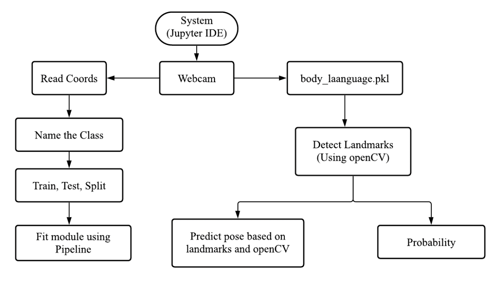
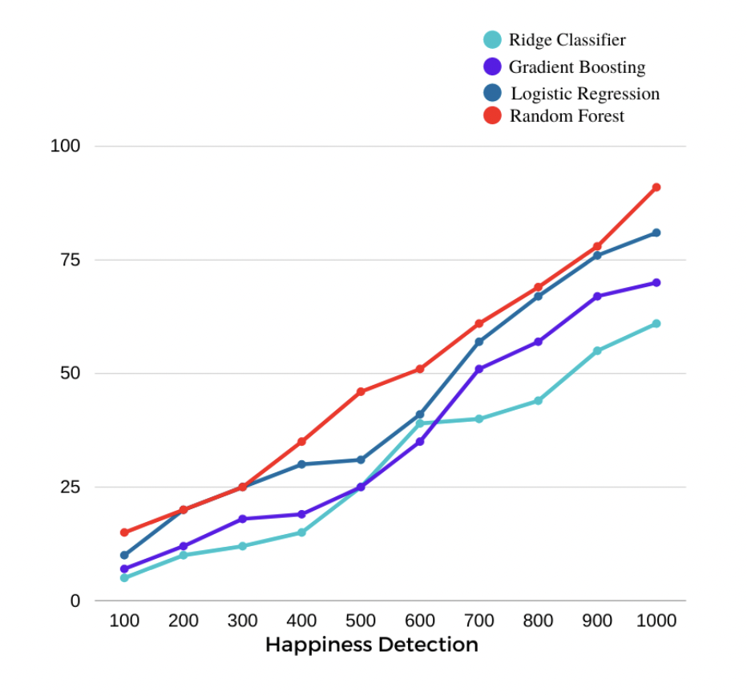
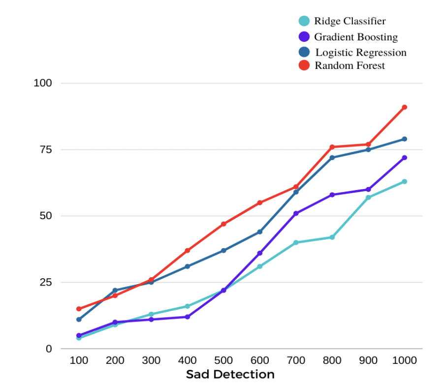
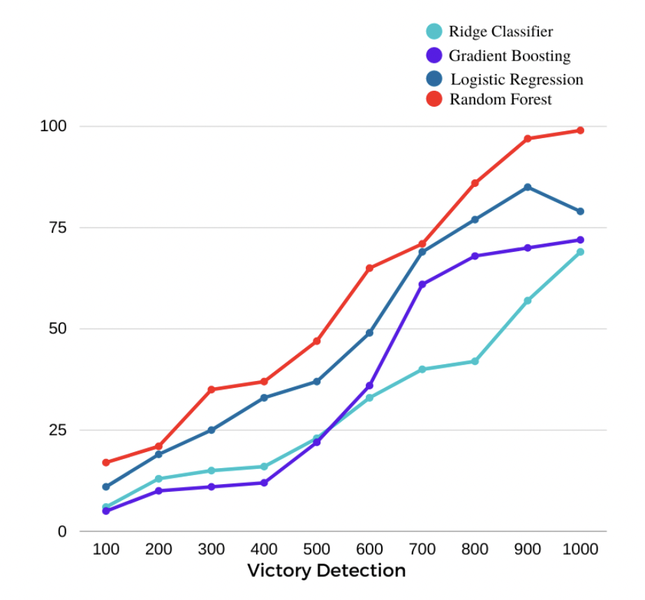
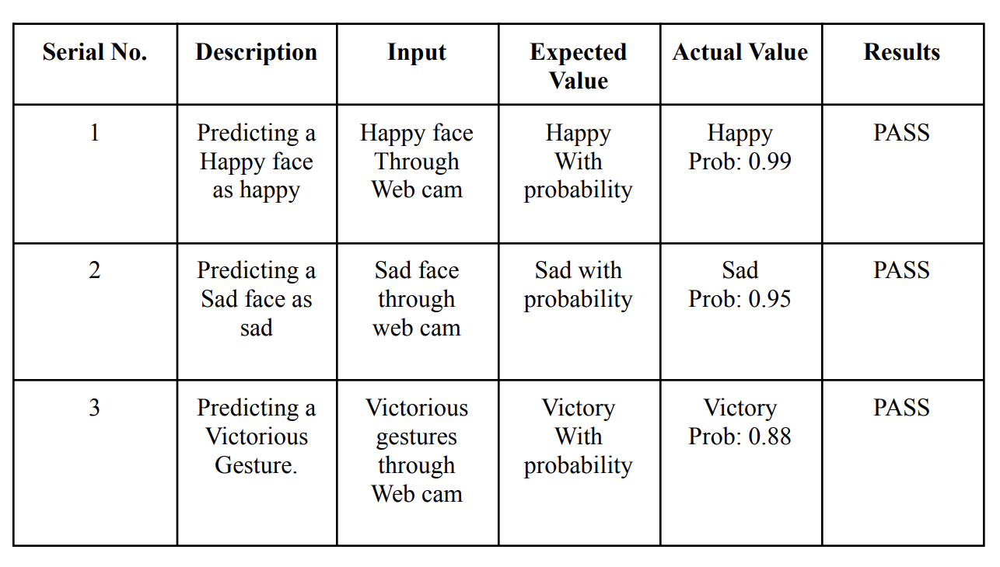

# Real Time Expression Detector

It is a realtime expression detector using MediaPipe, Python  & Machine learning algorithms.

## Brief Description

The realtime expression detector is designed using  Media Pipe and Python. Users can be able to leverage
their webcam to decode what their body language says at a point in time. So, specifically in
order to do this, the detector is leveraging pre-trained data as well as a custom machine learning model
to be able to take the landmarks from user's face as well as different poses from their body.

## Outline of Methodology 

## Dataset

OpenCV and CSV are used to capture the landmarks related to classified facial and
gesturing expressions. The collected data are stored in the spreadsheet which are used to train the
machine to assume the real time detected poses. The more we collect landmarks for different
body and face gestures, the more we get the accurate prediction results.

## Machine Learning Models

I have used the following 4 machine learning models for expression detection.

* Logistic Regression
* Ridge Classifier
* Random Forest
* Gradient Boosting

### Comparisons Between Models

## Results

## Required Resources

* Language: Python
* Platform: Jupyter Notebook IDE
* Packages: MediaPipe, cv2, csv, os, numpy, pandas, sklearn, train_test_split, pickle

